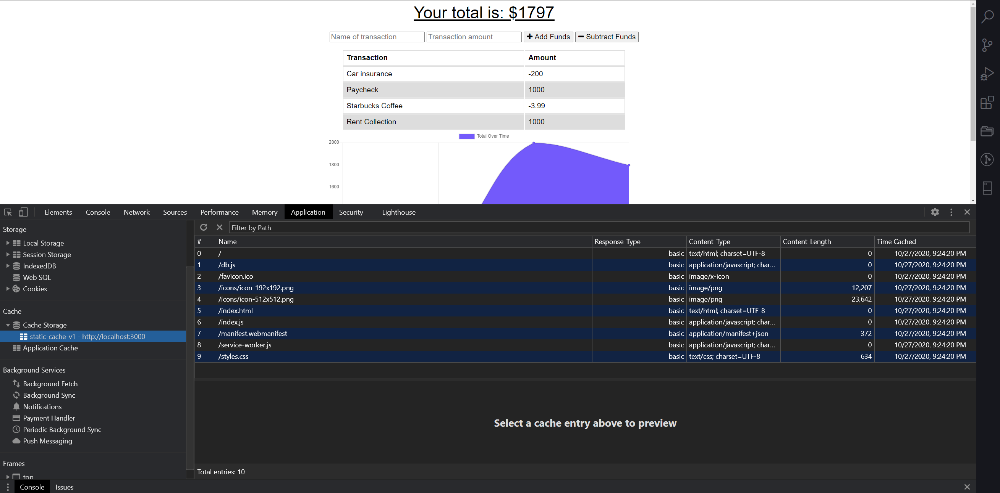
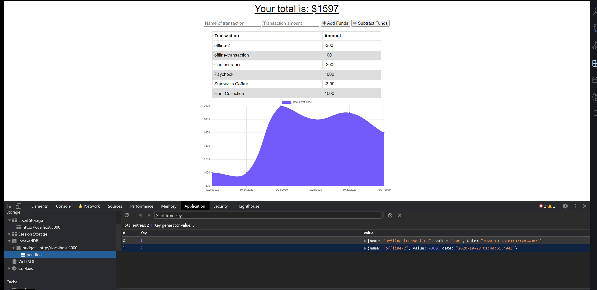
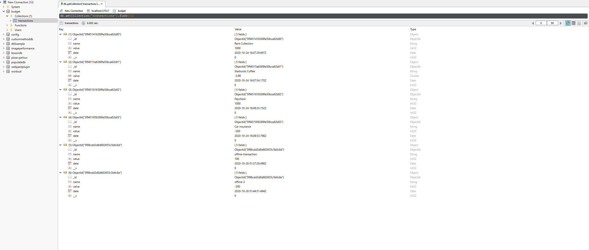

# my-budget-tracker

## Table of Contents

- [Description](#Description)
- [Tools_Used](#Tools_Used)
- [Links](#Links)
- [Application-Screen-Shots](#Application-Screen-Shots)
- [Credits](#Credits)

## Description

My-Budget-Tracker allows users provides a interface with an animated graph that instantly updates when a transaction is recorded online OR offline. The purpose of this application is to allow user access to the application functionality whether it is online or offline. I was successfully able to accomplish this by applying the key principals of creating a progressive web apps. This includes; creating a manifest, service worker, and cache.

## Tools Used

- HTML
- CSS
- JavaScript
- Bootstrap
- jQuery
- Express
- Mongoose Schema
- MongoDB
- MongoDB Atlas
- MVC Design
- Robo 3T

## Links (Application & Repo)

My-Budget-Tracker can be accessed at heroku link provided below:

Heroku Pages URL: <https://my-budget-tracker-raj.herokuapp.com/>

Github Repository: <https://github.com/rajdeep24/my-budget-tracker>

### Screenshots

#### Static Cache Storage

#### Pending Offline Transactions

#### Rendered Offline Transactions

## Credits

I would like to credit georgia tech's coding bootcamp and the support from my peers.

## Badges

